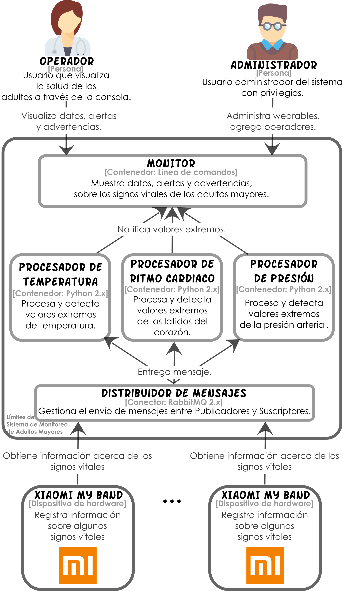

# Capítulo 3

## Sistema de Monitoreo de Adultos Mayores (SMAM)

Para el ejemplo práctico vamos a suponer la existencia de un asilo llamado Seten en el que viven un grupo de adultos mayores. Parte del personal que trabaja en el asilo, entre otras tareas, se dedica a monitorear el estado de salud de estas personas. 

Supongamos también que la fundación Arroyo de la Plata, que es una fundación altruista en la región, decidió a manera de donación desarrollarle al asilo un sistema de cómputo para realizar de forma (semi-)automática las actividades de monitoreo del estado de salud de los adultos mayores. Para ello, la fundación utilizó un conjunto de dispositivos wearables, de la marca Xiaomi My Band, que portan cada uno de los adultos mayores y permiten conocer algunos de sus signos vitales. Así, mediante el envío de información sobre ritmo cardiaco, presión arterial y temperatura estos dispositivos permitirán a los operadores del sistema monitorear en tiempo real a cada uno de los adultos mayores y de esta forma ser más eficientes en la prevención de incidencias. El monitoreo de los signos vitales se hará a través de un visor.

En la siguiente figura se muestra el diseño de la propuesta de solución del departamento de desarrollo para el SMAM.



## Prerrequisitos

Para poner en marcha el SMAM se requiere instalar algunas dependencias. Podrás encontrar estas dependencias en el archivo `requirements.txt`. También puedes instalar éstas dependencias con el comando:

```shell
pip install -r requirements.txt
```

**Nota:** se asume que el gestor de dependencias `pip` se ha instalado previamente.

## Ejecución

Actualmente el SMAM cuenta con dos versiones, una que puedes poner en marcha de forma local y otra que puedes poner en marcha de forma distribuida. Dentro del directorio `smam` se encuentran las instrucciones para poner en marcha cualquier versión del SMAM.

## Versión

2.0.1 - Mayo 2017

## Autores

* **Perla Velasco**
* **Yonathan Martínez**