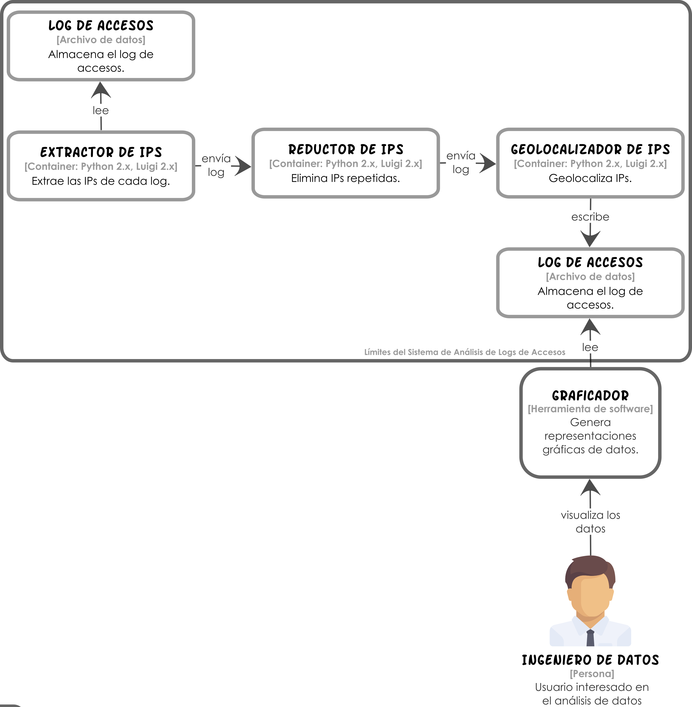

# Capítulo 4

## Sistema de Análisis de Logs de Accesos (SALA)

Para el ejemplo práctico vamos a suponer que existe una cadena de noticias que ofrece una variedad de contenidos a millones de usuarios de la web. En la empresa existen ingenieros de datos que se dedican a analizar la información en los logs de acceso que se generan.

Dado lo anterior, un análisis muy popular consiste en saber desde qué ciudades del mundo son leídos los contenidos de la cadena de noticias. 

Con el propósito de realizar esta tarea rápidamente, la cadena solicitó a los ingenieros de datos implementar el Sistema de Análisis de Logs de Accesos (SALA).

En la siguiente figura se muestra el diseño de la propuesta de solución de los ingenieros de datos para el SALA.



## Prerrequisitos

Para poner en marcha el SALA se requiere instalar algunas dependencias. Podrás encontrar estas dependencias en el archivo `requirements.txt`. También puedes instalar éstas dependencias con el comando:

```shell
pip install -r requirements.txt
```

**Nota:** se asume que el gestor de dependencias `pip` se ha instalado previamente.

## Ejecución

Una vez instaladas las dependencias del SALA, podrás ponerlo en marcha con el comando:

```shell
python geolocator_ip.py
```

## Versión

2.0 - Febrero 2018

## Autores

* **Perla Velasco**
* **Yonathan Martínez**
