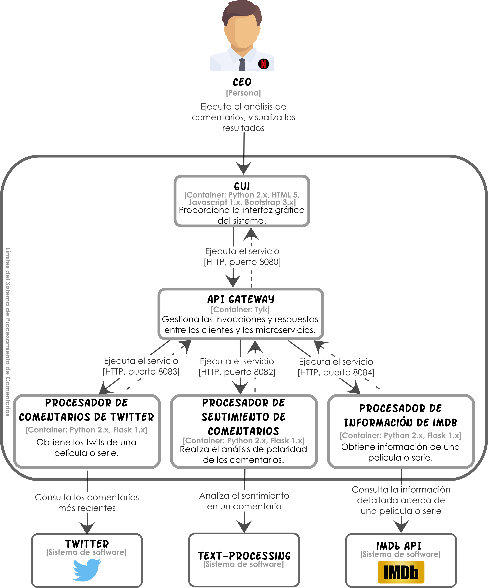

# Capítulo 5

## Sistema de Procesamiento de Comentarios (SPC)

Para el ejemplo práctico vamos a suponer que Netflix, una empresa estadounidense que ofrece contenido multimedia en línea a sus clientes, recién comienza a ofrecer contenidos propios. Aunque el CEO de Netflix quiere continuar con la producción de este tipo de contenidos, cosidera que necesita evidencia de que esto es redituable para la compañía. Buscando un mecanismo sencillo para obtener dicha evidencia, concluyó que un análisis de los comentarios que existen en Twitter sobre los contenidos propios de Netflix sería de utilidad. 

Dado lo anterior, le ha pedido al departamento de mercadotecnia de la empresa que realicen el análisis de dichos comentarios. Con el propósito de realizar esta tarea rápidamiente, el departamento de mercadotecnia solicitó al departamento de desarrollo de software de Netflix implementar el Sistema de Procesamiento de Comentarios (SPC), para que automatice dichos análisis.

En la siguiente figura se muestra el diseño de la propuesta de solución del departamento de desarrollo para el SPC.



## Prerrequisitos

Para poner en marcha el SPC se requiere instalar algunas dependencias. Podrás encontrar estas dependencias en el archivo `requirements.txt`. También puedes instalar éstas dependencias con el comando:

```shell
pip install -r requirements.txt
```

**Nota:** se asume que el gestor de dependencias `pip` se ha instalado previamente.

## Ejecución

Una vez instaladas las dependencias del SPC, podrás ponerlo en marcha ejecutando cada uno de los microservicios, como un proceso independiente, con los comandos:

```shell
python gui.py
python sv_information.py
python sv_text_analysis.py
python sv_twitter.py
```

Una vez puestos en marcha los microservicios y el `gui`, accede al sistema ingresando a la dirección local [http://localhost:8000/](http://localhost:8000/)

## Versión

1.0 - Marzo 2017

## Autores

* **Perla Velasco**
* **Yonathan Martínez**
